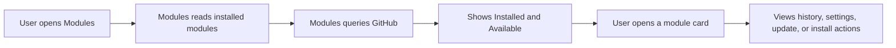

# Modules - user guide

## 1. What this plugin is for

`Modules` is used for centralized module and update management in `osysHome`.

With it, a user can:

- see the list of already installed modules;
- discover available modules from GitHub;
- install new modules;
- update individual modules and the `osysHome` core itself;
- open settings for installed modules;
- control background cycles of modules that support them;
- remove modules that are not protected system modules.

In practice, `Modules` is the main entry point for maintaining the plugin ecosystem inside the system.

## 2. What the user sees in the interface

In the `Modules` admin interface, the user sees:

- a `Refresh` button to reload data;
- an `Only with updates` switch to keep only modules with available updates;
- a `Filter...` field to search through cards;
- a `Settings` button for configuring the `Modules` plugin itself;
- an `Installed` tab with installed modules;
- an `Available` tab with modules found on GitHub;
- module cards with summary information and actions;
- a detailed modal window for the selected module.

### What is shown on an installed module card

An installed module card usually shows:

- the module icon;
- the module name or title;
- description;
- author;
- version;
- action badges such as `search`, `cycle`, `widget`;
- a link to the GitHub repository if known;
- a link to documentation if it is indexed by `Docs`;
- an `Upgrade` button if an update is available;
- `Start cycle`, `Stop cycle`, and `Restart cycle` buttons if the module supports a cyclic task.

If a module is disabled, its card is shown in a muted style and marked as `Inactive`.

### What is shown on an available module card

On the `Available` tab, the user sees:

- the repository name;
- repository description;
- author;
- GitHub topics, if present;
- star count;
- an `Install` button.

## 3. Where the plugin gets its information

`Modules` combines data from several sources.

### From `osysHome` itself

From the system API and database, the plugin gets:

- the list of installed modules;
- their current settings;
- active/inactive state;
- version, description, category, repository URL, and last update date;
- background cycle status, when available;
- system-wide core update flags.

### From GitHub

From GitHub, the plugin gets:

- the list of repositories found by the `osysHome` search query;
- repository descriptions;
- repository owner;
- default branch;
- latest commit dates;
- commit history for the selected module;
- star count;
- module images from `static/<ModuleName>.png`, if such a file exists in the repository.

### From the `Modules` plugin configuration

The plugin also uses its own settings:

- `update_time` - how often to check for updates;
- `token` - a GitHub token for API requests and higher rate limits.

> [!NOTE]
> The plugin also works without a GitHub token, but heavy usage may hit API rate limits sooner.

## 4. How module management works

A typical user flow looks like this:

## 5. Global settings of Modules itself

The `Settings` button at the top of the page opens the settings for the `Modules` plugin itself.

### Available settings

| Field | Meaning |
| --- | --- |
| `Update time` | Update check interval in minutes |
| `Token` | GitHub token for API access |

### When to change these settings

- lower `Update time` if you want updates to appear faster;
- increase `Update time` if you want fewer requests;
- fill in `Token` if you use many modules or often open commit history and repository lists.

## 6. What can be done with installed modules

When the user selects an installed module, a detailed modal window opens.

### History tab

Here the user can see:

- recent commits in the selected branch;
- commit author;
- commit message;
- commit date;
- an `Installed` marker for the currently installed version;
- the ability to install a specific commit.

This is useful when you need to:

- understand what changed in a new version;
- upgrade to a specific commit instead of the latest state;
- verify which version is currently installed.

### Settings tab for an installed module

For most installed modules, the following settings are available:

| Field | Purpose |
| --- | --- |
| `Active` | Enables or disables the module |
| `Title` | User-facing module name in the interface |
| `Category` | Module category |
| `Hidden in statusbar` | Hides the module in the control panel |
| `Hide widget in control panel` | Hides the module widget in the control panel |
| `Url repository for update` | Repository used as the update source |
| `Branch repository for update` | Branch used for commit history and updates |
| `Logging level` | Module logging level |

After changing these values, the user should click `Save`.

### What these installed-module settings mean

`Active`:
temporarily disables the module without removing it.

`Title`:
replaces the technical name with a more user-friendly one.

`Category`:
helps group modules logically in the interface.

`Hidden in statusbar`:
useful when a module should not be shown among common control panel items.

`Hide widget in control panel`:
keeps the module installed but removes its widget from the panel.

`Url repository for update`:
is useful when the module should update from a specific repository URL instead of an auto-detected one.

`Branch repository for update`:
lets you pin updates to a particular branch, such as `master`, `main`, or a testing branch.

`Logging level`:
is mainly for diagnostics. The default level is usually enough for normal work, while `DEBUG` is helpful during troubleshooting.

## 7. What can be configured for osysHome itself

For the `osysHome` card, the modal provides:

- core commit history;
- branch selection for core updates;
- updating the core to the latest or to a specific commit.

The main setting here is:

| Field | Purpose |
| --- | --- |
| `Branch repository for update` | The `osysHome` repository branch used to check for core updates |

## 8. Installing a new module

The `Available` tab shows modules found on GitHub.

To install a module:

1. Open `Modules`.
2. Go to the `Available` tab.
3. Find the required module using the filter or the list.
4. Click `Install`.
5. Wait until installation is complete.
6. Restart the system if requested.

During installation, the plugin:

- determines the repository;
- downloads the archive from GitHub;
- extracts files into `plugins/<ModuleName>`;
- installs dependencies if `requirements.txt` is present;
- registers the module in the system.

> [!IMPORTANT]
> Automatic discovery expects the repository naming convention `osysHome-ModuleName`.

## 9. Updating installed modules

If an update is found for a module, the user will see an `Upgrade` button.

There are two ways to update:

- quick update directly from the card;
- installing a specific commit through the `History` tab.

After an update:

- the module update flag is reset;
- the system gets a restart-required flag;
- dependencies may be updated automatically if `requirements.txt` exists.

## 10. Removing modules

Removal is not available for every module.

These modules cannot be removed:

- `Modules`;
- `Objects`;
- `Users`;
- `Scheduler`;
- `wsServer`.

For other modules, removal:

- deletes the module files;
- removes the module record from the system;
- tries to clean related database tables;
- requires confirmation in the interface.

## 11. Widget and notifications

`Modules` also adds a widget to the control panel.

The widget shows:

- whether a core update for `osysHome` is available;
- which modules currently have updates available.

The plugin also creates notifications when:

- a new update is found;
- installation succeeds;
- an update finishes;
- an installation, update, or removal error occurs.

## 12. Search and filtering

The user can:

- type text into `Filter...` to search through module cards;
- enable `Only with updates` to keep only items that currently require attention;
- use the global system search if the plugin is integrated through the `search` action.

The filter is stored in the browser and preserved between page visits.

## 13. Practical scenarios

### When it is useful to open Modules

- after installing a new `osysHome` version;
- when you want to check whether plugins have updates;
- when you need to temporarily disable a module without deleting it;
- when you want to change the update branch for a specific module;
- when you need to install a new module from GitHub;
- when you want to inspect commit history before updating.

### When it makes sense to configure a GitHub token

- if you have many modules;
- if you often open history tabs;
- if the system checks for updates regularly;
- if GitHub starts limiting requests without a token.

## 14. What is important to remember

- `Modules` shows not only local data but also information from GitHub;
- the settings of `Modules` itself affect update checks for the whole system;
- settings inside a module card belong to that specific installed module;
- some install and update operations may require a system restart;
- protected system modules cannot be removed.
